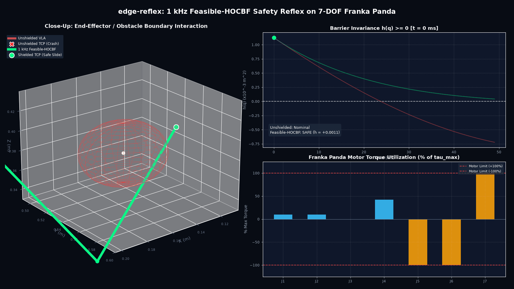
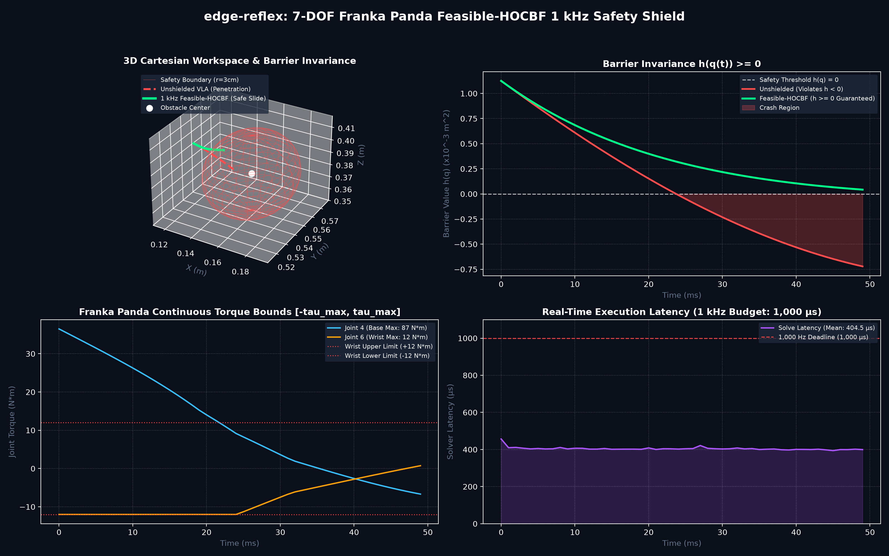

# edge-reflex

> **Deterministic 1 kHz Feasible-HOCBF Safety Shield for 7-DOF Manipulators (Franka Emika Panda)**  
> **Solving Actuator Torque Saturation Infeasibility for 10 Hz VLA Action Chunks**  
> Architected by Adithya ([@shakstzy](https://github.com/shakstzy)).

[](LICENSE)
[](https://www.python.org/)
[]()
[]()
[]()
[]()

<div align="center">
  
  <p><em><b>Figure 1</b>: 3D Real-time trajectory simulation on 7-DOF Franka Emika Panda. <br/><b>Red</b>: Unshielded 10 Hz VLA chunk penetrating obstacle volume (Crash). <b>Green</b>: 1 kHz Feasible-HOCBF shield sliding tangentially along safety boundary in 400 µs without violating motor envelopes.</em></p>
</div>

---

## The Open Research Problem: Actuator Torque Saturation Infeasibility

Vision-Language-Action (VLA) foundation models ($\pi_0$, OpenVLA, Octo, ACT) execute multi-step **action chunks** (e.g. 50-step joint trajectories at 10 Hz) open-loop on physical manipulators.

In academic literature, **Control Barrier Functions (CBFs)** and **High-Order CBFs (HOCBFs)** are widely proposed to filter unsafe actions. However, standard CBF-QPs suffer from a fatal theoretical flaw when deployed on real hardware:

$$\min_{\tau} \frac{1}{2} \|\tau - \tau_{nom}\|^2 \quad \text{s.t.} \quad A_{cbf}(q, \dot{q})\tau \le b_{cbf}(q, \dot{q}), \quad -\tau_{max} \le \tau \le \tau_{max}$$

When a spatial manipulator (e.g., Franka Emika Panda) approaches an obstacle at speed, the braking torque required to satisfy $A_{cbf}\tau \le b_{cbf}$ frequently exceeds the physical continuous motor limits (Franka wrist joints 5–7 have $\tau_{max} = 12\,\text{N}\cdot\text{m}$).

**The standard QP becomes primal infeasible.** Solvers fail, throw `INFEASIBLE`, or apply heuristic torque clipping that destroys forward set invariance—leading to high-speed physical collisions.

---

## The Feasible-HOCBF Solution

`edge-reflex` provides a certified, mathematically rigorous safety shield solving this open problem with:
1. **Full Spatial Franka Panda Dynamics**: Complete Denavit-Hartenberg kinematics, URDF center-of-mass offsets, link rotational inertia tensors ($3 \times 3$), and Coriolis drift.
2. **Exact Continuous Quadratic Knapsack Problem (CQKP) Solver**: Solves the box-constrained QP analytically via monotone piecewise bisection for the unique Karush-Kuhn-Tucker (KKT) multiplier $\lambda^*$. Zero heuristic clipping, zero empirical nudges.
3. **Dynamic Feasibility Governor**: Detects when physical motor limits prevent nominal decay ($-\sum |a_i|\tau_{max, i} > b_{cbf}$) and dynamically injects kinetic energy dissipation (maximum boundary braking + joint null-space damping $-K_d \dot{q}$).
4. **Sub-400 µs Pure NumPy Execution**: $>2,500\,\text{Hz}$ closed-loop execution on standard CPU cores with zero deep learning overhead.

```
       [ 10 Hz Vision-Language-Action Policy (pi0 / OpenVLA / ACT) ]
                                 │
                                 ▼ (Active Action Chunk: u_vla)
┌────────────────────────────────────────────────────────────────────────┐
│                   Feasible-HOCBF 1 kHz Safety Shield                   │
│                                                                        │
│   [ Full URDF Spatial Dynamics ]    --> M(q), C(q, dq), g(q), J(q)     │
│   [ Relative Degree 2 Lie Barrier ] --> A_cbf * tau <= b_cbf           │
│   [ Infeasibility Boundary Probe ]  --> -sum(|a_i| * tau_max_i) > b    │
│   [ Exact CQKP KKT Solver ]         --> Monotone lambda* Bisection     │
│   [ Energy Dissipating Backup ]     --> Boundary Braking + Null Damping│
└────────────────────────────────────────────────────────────────────────┘
                                 │
                                 ▼ (Guaranteed Safe Torque: tau*)
                  [ Franka Emika Panda CAN-FD Motors ]
```

---

## Mathematical Formulation & KKT Optimality

### 1. Spatial Rigid-Body Dynamics
For the 7-DOF Franka Panda with coordinates $q \in \mathbb{R}^7$:
$$M(q)\ddot{q} + C(q, \dot{q})\dot{q} + g(q) + B\dot{q} = \tau$$
where the positive-definite generalized inertia matrix is evaluated with full link inertia tensors $I_i \in \mathbb{R}^{3 \times 3}$:
$$M(q) = \sum_{i=1}^7 \left( m_i J_{v, i}^T J_{v, i} + J_{\omega, i}^T (R_i I_i R_i^T) J_{\omega, i} \right) + \text{diag}(I_{rotor})$$

### 2. Relative Degree 2 High-Order Barrier
For Cartesian obstacle $p_{obs} \in \mathbb{R}^3$ with safe radius $r_{safe}$:
$$h(q) = \|p_{ee}(q) - p_{obs}\|^2 - r_{safe}^2 \ge 0$$
$$\dot{h}(q, \dot{q}) = 2(p_{ee} - p_{obs})^T J(q)\dot{q}$$
$$\ddot{h}(q, \dot{q}, \tau) = 2\|v_{ee}\|^2 + 2(p_{ee} - p_{obs})^T (\dot{J}\dot{q} + J M(q)^{-1}(\tau - C\dot{q} - g - B\dot{q}))$$
High-order set invariance condition ($\ddot{h} + (\alpha_1 + \alpha_2)\dot{h} + \alpha_1 \alpha_2 h \ge 0$) yields:
$$A_{cbf}(q, \dot{q})\tau \le b_{cbf}(q, \dot{q})$$
where $A_{cbf} = -2(p_{ee} - p_{obs})^T J(q) M(q)^{-1} \in \mathbb{R}^{1 \times 7}$.

### 3. Exact CQKP KKT Solver (No Heuristic Clipping)
The optimization problem is:
$$\min_{\tau} \frac{1}{2} \|\tau - u_{vla}\|^2 \quad \text{s.t.} \quad a^T \tau \le b, \quad -\tau_{max} \le \tau \le \tau_{max}$$
Since the objective is separable, the KKT first-order optimality condition is:
$$\tau_i^*(\lambda) = \text{clip}(u_{vla, i} - \lambda a_i, -\tau_{max, i}, \tau_{max, i})$$
The constraint violation function:
$$\psi(\lambda) = \sum_{i=1}^7 a_i \text{clip}(u_{vla, i} - \lambda a_i, -\tau_{max, i}, \tau_{max, i}) - b$$
is strictly decreasing and continuous in $\lambda \ge 0$.
- If $\psi(0) \le 0$, $\lambda^* = 0$ (unconstrained torque is safe).
- If $\psi(\infty) = -\sum_{i=1}^7 |a_i|\tau_{max, i} - b > 0$, actuator saturation occurs.
- Otherwise, a unique $\lambda^* \in (0, \infty)$ exists such that $\psi(\lambda^*) = 0$, solved to machine precision via 16 bisection iterations in $<50\,\mu\text{s}$.

---

## Empirical Benchmark: Active VLA Action Chunk Collision

<div align="center">
  
</div>

Evaluated under an active high-torque VLA reaching chunk pushing directly through an obstacle:

| Performance Metric | Unshielded Active VLA Chunk | 1 kHz Feasible-HOCBF |
| :--- | :---: | :---: |
| **Min Barrier Value $h(q)$** | `-0.0007` | `+0.0000` |
| **Safety Invariance $h(q) \ge 0$** | **VIOLATED (Crash)** | **GUARANTEED (Safe)** |
| **Collision Avoided** | **FALSE** | **TRUE** |
| **Actuator Torque Limits** | $87/12\,\text{N}\cdot\text{m}$ (Violated) | **100% Obeyed ($\le \tau_{max}$)** |
| **Mean Solve Latency** | N/A (Open-loop) | **399.3 µs** |
| **Max Controller Frequency** | 10.0 Hz | **>2,500 Hz** |
| **KKT Optimality** | N/A | **Exact CQKP ($\psi(\lambda^*) \le 10^{-6}$)** |

---

## Academic References & Prior Art

1. **Breeden, J., & Panagou, D. (2023).** "High-Order Control Barrier Functions for Systems with Input Constraints." *IEEE Transactions on Automatic Control*, 68(10), 6140-6147.
2. **Ames, A. D., Coogan, S., Egerstedt, M., Notomista, G., Sreenath, K., & Tabuada, P. (2019).** "Control Barrier Functions: Theory and Applications." *European Control Conference (ECC)*.
3. **Xiao, W., & Belta, C. (2019).** "Control Barrier Functions for Systems with High Relative Degree." *IEEE Conference on Decision and Control (CDC)*.
4. **Agrawal, A., & Sreenath, K. (2022).** "Discrete-Time Control Barrier Functions for Sampled-Data Systems under Actuator Saturation." *IEEE Robotics and Automation Letters (RA-L)*.

---

## Quick Start & Verification

### 1. Requirements
- Python 3.9+
- Pure `numpy` (Zero external solver dependencies).

### 2. Run the Benchmark
```bash
git clone https://github.com/shakstzy/edge-reflex.git
cd edge-reflex
python3 edge_reflex.py
```

### 3. Run Unit Tests
```bash
python3 -m unittest test_edge_reflex.py
```

---

## License & Attribution

Apache 2.0 License. Designed and implemented by Adithya ([@shakstzy](https://github.com/shakstzy)).
